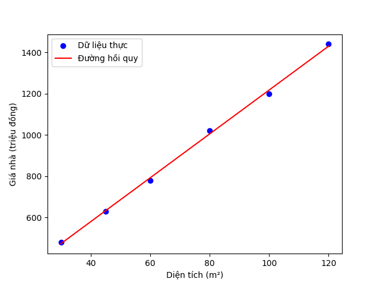
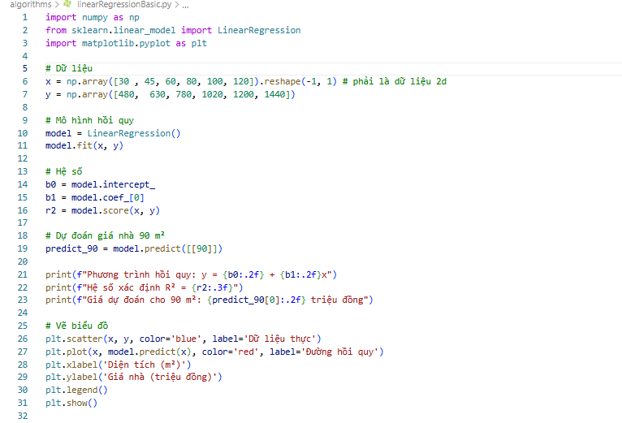

# TÌM HIỂU TRÍ TUỆ NHÂN TẠO AI
---
## Lời Mở Đầu
Trong kỷ nguyên số, Trí tuệ Nhân tạo (Artificial Intelligence - AI) không chỉ đơn thuần là một công nghệ, mà đã trở thành biểu tượng cho khả năng mô phỏng và mở rộng tư duy của con người thông qua máy móc.

Mặc dù khái niệm về AI đã manh nha từ những năm 50 của thế kỷ trước, nhưng phải đến thời gian gần đây, nó mới thực sự có những bước nhảy vọt ngoạn mục. Những tiến bộ này không chỉ phản ánh sự trưởng thành của công nghệ, mà còn cho thấy một bước tiến vĩ đại trong nhận thức của con người. Chúng ta đang dần khai phá các mô hình của tự nhiên thông qua việc thấu hiểu chính bản thân mình, trong một quá trình có thể được xem như sự "bắt chước có ý thức" một cách tinh vi và sáng tạo.

Ngày nay, AI đang len lỏi vào hầu hết mọi lĩnh vực - từ y tế, tài chính, giáo dục cho đến nghệ thuật - và khẳng định vị trí là trái tim của cuộc Cách mạng Công nghiệp 4.0.

Mục tiêu của tài liệu này là trình bày những kiến thức toán học nền tảng của AI một cách đơn giản và dễ hiểu nhất, giúp bất kỳ ai cũng có thể tiếp cận và nhận biết được sức mạnh của nó.

Tài liệu được biên soạn với các mục đích cụ thể:

- Tính dễ tiếp cận: Giúp những người chưa có nền tảng về toán học hay AI có thể hiểu được những khái niệm cốt lõi một cách cơ bản nhất.

- Tính thực tiễn: Kết hợp hài hòa giữa lý thuyết, minh họa thực nghiệm và các ứng dụng trong thực tế.
---

**Biên soạn:** *Trần Hoàng Linh petertranhoanglinh@gmail.com*  
**Chương trình:** *AI ứng dụng từ zero*  

## Chương 1 Toán học cơ bản
### Bài 1 Hồi quy tuyến tính
#### 1.1 Hồi quy tuyến tính cơ bản Linner Regression Basic
##### a. công thức
\[
y = b_0 + b_1x
\]
##### a. công thức tìm $b_1$
 $$b_1 = \frac{\sum (x_i - \bar{x})(y_i - \bar{y})}{\sum (x_i - \bar{x})^2}$$
##### b. công thức tìm $b_0$
 $$b_0 = \bar{y} - b_1 \bar{x}$$

##### bài tập ví dụ.
- Diện tích: 30, 45, 60, 80, 100, 120
- Giá nhà: 480, 630, 780, 1020, 1200, 1440
Dùng hồi quy tuyến tính để dự đoán giá nhà khi diện tích là $80~\mathrm{m}^2$

Giải bài toán: 
- Bước 1: Tìm giá trị X và Y trung bình:
    - $ \bar{x} = \frac{30 + 45 + 60 + 80 + 100 + 120}{6} = 72.5 $
    - $ \bar{y} = \frac{480 + 630 + 780 + 1020 + 1200 + 1440}{6} = 925$

- Bước 2: Tìm $b_1$

    - lập bảng so sách phương sai của từng giá trị với giá trị trung bình 

    | x   | y    | $(x_i - \bar{x})$ | $(y_i - \bar{y})$ | $((x_i - \bar{x})^2)$ | $((x_i - \bar{x})(y_i - \bar{y}))$ |
    | --- | ---- | --------------- | --------------- | ------------------- | -------------------------------- |
    | 30  | 480  | -42.5           | -445            | 1806.25             | 18962.5                          |
    | 45  | 630  | -27.5           | -295            | 756.25              | 8112.5                           |
    | 60  | 780  | -12.5           | -145            | 156.25              | 1812.5                           |
    | 80  | 1020 | 7.5             | 95              | 56.25               | 712.5                            |
    | 100 | 1200 | 27.5            | 275             | 756.25              | 7562.5                           |
    | 120 | 1440 | 47.5            | 515             | 2256.25             | 24462.5                          |

    - tổng các cột 
      - $ \sum (x_i - \bar x )² $ = 5787.5
      - $  (x_i - \bar x )  (y_i - \bar y ) $ = 61625
    - tính hệ số $b_1 = \frac{\sum (x_i - \bar{x})(y_i - \bar{y})}{\sum (x_i - \bar{x})^2} = \frac{5787}{61625} ≈10.65$
    - tính hệ số $b_0 = \bar{y} - b_1 \bar{x} =  925 - 10.65(72.5) =  153.875$
    
    Phương trình hồi quy dự đoán giá nhà theo m² có dạng: 
        $$ y = 10.65 + 158.875 x $$
    Dựa vào phương trình hồi quy ta có thể dự đaons giá nhà khi diện tích là $80~\mathrm{m}^2$ là :
    $$ PriceHouse = 10.65 + 158.875 \times 80 = 13562 $$
    
##### Sử dụng trong python cơ bản

##### Ưu nhược điểm của thuật toán
 Ưu điểm: 
        - Dễ triển khai  
        - Tính toán nhanh và đơn giải
        - Ít tham số phức tạp
 Nhược điểm:
        - Chỉ thật sự hiệu quả và có độ chính xác cao với mô hình dữ liệu có tính tuyến tính 
        - Dễ bị nhiễu nếu dữ liệu chỉ cần 1 vài dữ liệu ko chính xác sẽ dẫn đến hệ thống bị sụp đổ
        - Không phù hợp với bài toán đánh gía cần nhiều tiêu chí đầu vào.

#### 1.2 Hồi quy tuyến tính bội Multiple Linear Regression

##### a. Khái niệm
Nếu ở mô hình trước bạn dự đoán giá nhà theo diện tích,
thì trong hồi quy tuyến tính bội, bạn có thể dự đoán giá nhà theo nhiều yếu tố, ví dụ:

- Diện tích nhà (m²)
- Số phòng ngủ
- Khoảng cách đến trung tâm
- Năm xây dựng, v.v.
##### b. công thức
\[
  y=b_0​+b_1​x_1​+b_2​x_2​+⋯+b_n​x_n​
\]

